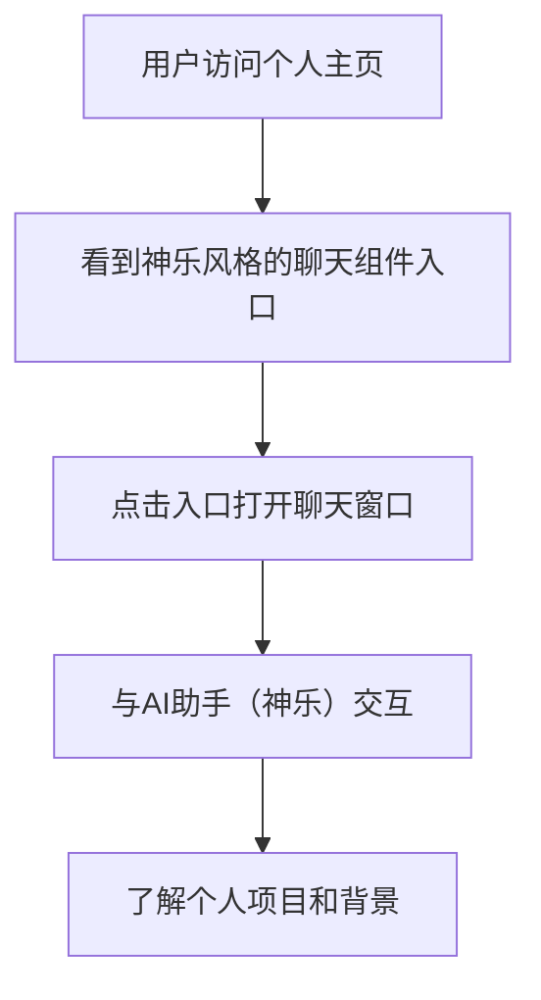

# 个人主页 v1.1 需求文档

## 1. 产品概览

个人主页是一个展示个人信息、项目经历和技能的单页应用，同时集成了AI数字人功能，允许访客与AI助手进行交互，了解个人项目和背景。

## 2. 核心功能

### 2.1 功能模块

本次更新主要集中在AI数字人聊天组件的优化，包括以下模块：

1. **聊天组件入口优化**：添加具有"神乐"风格的活泼入口，包括悬浮引导气泡、按钮交互和窗口弹出动效
2. **聊天窗口设计**：实现毛玻璃效果、品牌渐变色头部、改进的消息气泡和输入框设计
3. **知识库更新**：添加加班倒计时项目信息，丰富知识库内容
4. **AI人设优化**：将AI助手设置为《银魂》中神乐的风格，增加趣味性

### 2.2 页面详情

| 页面名称 | 模块名称 | 功能描述 |
|---------|---------|--------|
| 个人主页 | 聊天组件入口 | 显示具有"神乐"风格的活泼入口，包括悬浮引导气泡、按钮交互和窗口弹出动效 |
| 个人主页 | 聊天窗口 | 实现毛玻璃效果、品牌渐变色头部、改进的消息气泡和输入框设计 |
| 个人主页 | 精选项目 | 添加加班倒计时项目，显示四个精选项目，一行显示两个 |
| 个人主页 | AI助手 | 以神乐的风格与用户交互，介绍个人项目和背景 |

## 3. 核心流程

用户访问个人主页 → 看到神乐风格的聊天组件入口 → 点击入口打开聊天窗口 → 与AI助手（神乐）交互 → 了解个人项目和背景

## 4. 用户界面设计

### 4.1 设计风格

- **主色调**：品牌渐变色（从橙色 #FF6600 渐变到粉色 #FF4D4D）
- **辅助色**：黑色、白色、灰色
- **按钮风格**：圆角按钮，悬停效果
- **字体**：无衬线字体，清晰易读
- **布局风格**：响应式布局，移动端友好

### 4.2 页面设计概览

| 页面名称 | 模块名称 | UI元素 |
|---------|---------|-------|
| 个人主页 | 聊天组件入口 | 悬浮引导气泡（"你好呀阿鲁 👋"），圆形头像按钮，具有悬停和点击效果 |
| 个人主页 | 聊天窗口 | 毛玻璃效果背景，品牌渐变色头部，改进的消息气泡，悬浮输入框 |
| 个人主页 | 精选项目 | 网格布局，一行显示两个项目卡片，包含项目标题、描述和技术栈 |

### 4.3 响应式设计

- **桌面端**：聊天窗口宽度为96px，精选项目一行显示两个
- **平板端**：聊天窗口宽度为96px，精选项目一行显示两个
- **移动端**：聊天窗口宽度为80px，精选项目一行显示一个

## 5. 技术实现

### 5.1 技术栈

- **前端框架**：React, Next.js
- **样式方案**：Tailwind CSS
- **AI集成**：DeepSeek API
- **状态管理**：React useState

### 5.2 核心功能实现

1. **聊天组件入口优化**：使用Tailwind CSS实现悬浮引导气泡、按钮交互和窗口弹出动效
2. **聊天窗口设计**：使用Tailwind CSS实现毛玻璃效果、品牌渐变色头部、改进的消息气泡和输入框设计
3. **知识库更新**：在data/knowledgeBase.ts中添加加班倒计时项目信息
4. **AI人设优化**：在app/api/chat/route.ts中修改System Prompt，设置为神乐的风格

## 6. 部署与发布

项目使用Next.js框架，可通过Vercel、Netlify等平台进行部署。部署前需确保环境变量配置正确，特别是DeepSeek API密钥。

## 7. 版本更新

本次更新为v1.1版本，主要更新内容包括：

- 优化AI数字人聊天组件的设计和交互
- 添加加班倒计时项目信息
- 将AI助手设置为《银魂》中神乐的风格
- 改进聊天窗口的视觉效果

## 8. 总结

个人主页v1.1版本通过优化AI数字人聊天组件的设计和交互，提高了用户体验和趣味性。同时，添加了加班倒计时项目信息，丰富了个人项目展示。通过将AI助手设置为《银魂》中神乐的风格，增加了与用户交互的趣味性，使个人主页更加生动和个性化。